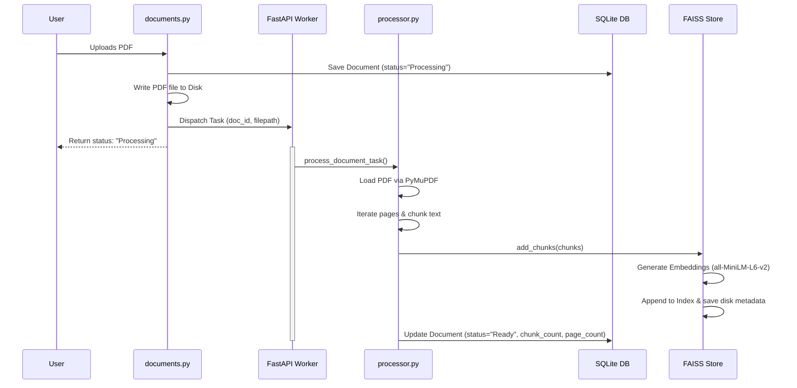

# Notebook AI / NoteGenie — Comprehensive Technical Architecture Manual

This document provides a highly detailed breakdown of the architectures, codebase structures, database schemas, processing algorithms, and visual systems for both RAG implementations co-existing on this machine.

---

# PART 1: The Modern Python + Next.js Stack (`e:\NotebookAI`)

This stack is built using a modern decoupled architecture: a **FastAPI** backend orchestrating local AI services and a **Next.js 16** frontend presenting a warm, organic, serif-accented reading workspace.

```
e:\NotebookAI\
├── backend\
│   ├── ai\
│   │   ├── embedder.py       # Sentence-Transformers embedder wrapper
│   │   ├── llm.py            # Local Ollama streaming integration (120s timeout)
│   │   └── vector_store.py   # FAISS FlatIP index + metadata controller
│   ├── api\
│   │   ├── dependencies.py   # SQLAlchemy session dependencies
│   │   ├── routers\
│   │   │   ├── chats.py      # Conversation management & SSE streaming
│   │   │   └── documents.py  # PDF upload, listing, and deletion
│   │   └── schemas\
│   │       └── schemas.py    # Pydantic schemas for data validation
│   ├── database\
│   │   ├── database.py       # SQLite connection and session initialization
│   │   └── models.py         # SQLAlchemy schemas (Chat, Message, Document, Citation)
│   ├── storage\
│   │   ├── db\               # SQLite db path
│   │   ├── documents\        # Ingested PDF storage
│   │   └── vectors\          # FAISS index files (.faiss & metadata JSON)
│   └── main.py               # Uvicorn entry point & CORS configuration
└── frontend\
    ├── src\
    │   ├── app\
    │   │   ├── chat\
    │   │   │   └── [id]\     # Split-screen workspace, PDF Viewer iframe, chat window
    │   │   │       └── page.tsx
    │   │   ├── dashboard\    # Ingested PDF management view
    │   │   │   └── page.tsx
    │   │   ├── globals.css   # Main stylesheet overriding Tailwind styles
    │   │   └── layout.tsx    # App shell loading Lora (Serif) & Inter (Sans-serif)
```

---

## 1. Backend Specifications (FastAPI)

### A. Database Layer & Schemas (`database/models.py`)
Persisted inside `storage/db/rag.db` (SQLite). Foreign key cascades are configured to prevent orphan records.

*   **`Document` Table**:
    *   `id` (String, Primary Key): UUID generated at upload time.
    *   `filename` (String, Not Null): Original uploaded name of the PDF.
    *   `page_count` (Integer, Nullable): Total pages extracted by PyMuPDF.
    *   `chunk_count` (Integer, Nullable): Total generated segments.
    *   `upload_date` (DateTime, Default: UTC Now).
    *   `status` (String): Ingestion states (`Processing`, `Ready`, `Failed`).
*   **`Chat` Table**:
    *   `id` (String, Primary Key): Session identification token.
    *   `document_id` (String, Foreign Key -> `Document.id`): Active PDF binding.
    *   `created_at` / `updated_at` (DateTime).
*   **`Message` Table**:
    *   `id` (Integer, Primary Key, Auto-increment).
    *   `chat_id` (String, Foreign Key -> `Chat.id`).
    *   `role` (String): Role of the messenger (`user` or `assistant`).
    *   `content` (Text, Not Null): Raw string message body.
    *   `created_at` (DateTime).
*   **`Citation` Table**:
    *   `id` (Integer, Primary Key).
    *   `message_id` (Integer, Foreign Key -> `Message.id`).
    *   `document_id` (String, Foreign Key -> `Document.id`).
    *   `page_number` (Integer): Page number index of context.
    *   `source_text` (Text): Matching text excerpt.

---

### B. Vector Index Layer (`ai/vector_store.py`)
Combines FAISS indexing with a metadata mapping cache.

*   **Embedding Pipeline**:
    *   Generates embeddings via **Sentence-Transformers** using the `all-MiniLM-L6-v2` model (384-dimensional vectors).
    *   Features flat inner-product indexing (`faiss.IndexFlatIP`) because vectors are normalized beforehand to save on cosine distance computation overhead.
*   **In-Memory Retrieval Logic**:
    *   `search(query, document_id, top_k)`: Encodes the user question, queries FAISS for `top_k * 2` indexes, filters index matching values against `document_id` tags, and returns page/text pairs.
    *   `get_first_chunks(document_id, k)`: A metadata fallback function designed to return the first `k` page blocks of a document. This is triggered when a user query contains terms matching summary intents (e.g. *“summarize”*, *“tell me about this document”*).

---

### C. Large Language Model Integration (`ai/llm.py`)
Uses the local **Ollama** API server to run inference.

*   **Model Options**: Configured to query `qwen2.5:0.5b` or `llama3`.
*   **Connection Resilience**:
    *   Created using `httpx.AsyncClient` with a custom `timeout=120.0` configuration parameter. Local CPU-only systems can experience initial response latency (Time-To-First-Token) exceeding 30-40 seconds when loaded with large document context prompts. Extending the timeout prevents premature HTTP socket termination.
*   **Streaming completions**:
    *   Tokens are streamed to Next.js using a Python generator that processes Ollama's JSON response blocks.
    *   Responses are yielded as Server-Sent Events (SSE) using FastAPI `StreamingResponse` inside [chats.py](file:///E:/NotebookAI/backend/api/routers/chats.py).

---

## 2. Frontend Specifications (Next.js 16)

### A. Core Views & Components
*   **Split-Screen Chat (`src/app/chat/[id]/page.tsx`)**:
    *   **PDF Panel**: An `<iframe>` pointing to the mounted backend static files route: `http://127.0.0.1:8000/documents/{document_id}.pdf`.
    *   **Chat Panel**: Custom React messaging component displaying user prompts, Markdown-formatted bot answers, copy buttons, and inline citation chips linking to page offsets.
*   **Document Dashboard (`src/app/dashboard/page.tsx`)**:
    *   Dropzone interface allowing users to upload new PDFs, monitor processing progress, and delete obsolete databases.

### B. Solved Network & Scroll Constraints
*   **IPv6 Port Binding Mitigation**: All API connections are routed directly to `http://127.0.0.1:8000` instead of `http://localhost:8000`. Windows network stacks resolve `localhost` via IPv6 loopback addresses (`::1`) which introduces routing overhead and socket failures on Node processes.
*   **Intelligent Scroll Handler**:
    *   The message panel listens to standard `onScroll` event behaviors. If the user scrolls upwards past a threshold value (meaning they are reading history), auto-scroll snapping is disabled.
    *   When the user stays scrolled near the bottom, the container auto-updates scroll height offset targets sequentially as new streaming tokens are received.

---

# PART 2: The Single-Process Node.js Prototype (`e:\Proj`)

A lightweight prototype that packages the entire RAG cycle inside a single Express application. It runs locally on port 3000.

```
e:\Proj\
├── css\
│   └── styles.css      # Warm human-centric styling layout
├── js\
│   └── app.js          # Client interactions, marked parsing, and state controls
├── ai.js               # Lazy loading of Transformers.js, cosine sim, generation
├── db.js               # SQLite promises layer (rag.sqlite)
├── index.html          # Main HTML5 App markup
├── package.json        # Dependencies list (Express, Transformers, sqlite3)
├── processor.js        # PDF parser using pdf-parse & overlapping sentence chunker
└── server.js           # Server routes & API Controller
```

---

## 1. Database Schema (`db.js`)
Persisted inside [rag.sqlite](file:///e:/Proj/rag.sqlite) using two tables:

```sql
CREATE TABLE IF NOT EXISTS documents (
  id TEXT PRIMARY KEY,
  filename TEXT NOT NULL,
  uploadedAt DATETIME DEFAULT CURRENT_TIMESTAMP
);

CREATE TABLE IF NOT EXISTS chunks (
  id INTEGER PRIMARY KEY AUTOINCREMENT,
  documentId TEXT NOT NULL,
  text TEXT NOT NULL,
  embeddingJSON TEXT NOT NULL,
  FOREIGN KEY(documentId) REFERENCES documents(id) ON DELETE CASCADE
);
```
*Manual cascade delete handles are programmed in [db.js](file:///e:/Proj/db.js) to clear chunks whenever a parent document is deleted.*

---

## 2. Ingest & Chunking Pipeline (`processor.js`)

*   **PDF Extraction**: Reads uploaded binary buffers using `pdf-parse`.
*   **Chunking Algorithm**:
    *   Splits text into sentences using standard punctuation bounds regex matches: `/[^.!?]+[.!?]+/g`.
    *   Iterates sentences sequentially, accumulating text inside a buffer loop.
    *   Once a buffer exceeds 1,000 characters, it registers the chunk, flushes the state, and begins building the next chunk.
*   **Vectorization**: Feeds each chunk sequentially to `generateEmbedding(text)` inside [ai.js](file:///e:/Proj/ai.js).

---

## 3. Local Model Pipeline (`ai.js`)

Uses `@huggingface/transformers` to download and load models lazily on-demand:

*   **Embedding Generator**: Loaded via `pipeline('feature-extraction', 'Xenova/all-MiniLM-L6-v2')`. Computes 384-dimensional float arrays.
*   **Text Generator**: Loaded via `pipeline('text-generation', 'Xenova/Qwen1.5-0.5B-Chat')`. Runs local floating-point model calculations.
*   **Manual Cosine Similarity**:
    Since standard FAISS is not available in Node, similarity calculation is computed using this function:
    $$\text{Similarity}(A, B) = \frac{A \cdot B}{\|A\| \|B\|}$$
    ```javascript
    export function cosineSimilarity(vecA, vecB) {
      let dotProduct = 0;
      let normA = 0;
      let normB = 0;
      for (let i = 0; i < vecA.length; i++) {
        dotProduct += vecA[i] * vecB[i];
        normA += vecA[i] * vecA[i];
        normB += vecB[i] * vecB[i];
      }
      if (normA === 0 || normB === 0) return 0;
      return dotProduct / (Math.sqrt(normA) * Math.sqrt(normB));
    }
    ```

---

## 4. UI/UX Design System Tokens (`css/styles.css`)

The style system uses custom CSS tokens to implement an organic reading aesthetic:

```css
:root {
  /* Colors */
  --bg-base:        #fdfcfb; /* Warm ivory canvas background */
  --bg-card:        #f4f1eb; /* Earth-tinted sidebar backgrounds */
  --bg-elevated:    #ffffff;
  --bg-hover:       #eae6df;
  
  --accent-terracotta:       #d97757; /* Warm clay primary accent */
  --accent-terracotta-hover: #c26748;
  --accent-sage:             #7a907c; /* Muted sage-green secondary accent */
  --accent-sage-hover:       #677b69;

  --text-primary:   #2b2b2b; /* Deep charcoal (softer than black) */
  --text-secondary: #4a4a4a;
  --text-muted:     #737373;

  /* Typography */
  font-family: 'Lora', serif; /* Chat messages readability font */
  font-family: 'Inter', sans-serif; /* Functional interface elements */
}
```

---

# PART 3: The Active Ingestion implementation Plan

We are scheduled to implement the missing background PDF processing task on the **Python + Next.js** stack to enable active document RAG.



### Proposed Code Updates:
1.  **FastAPI Background Ingestion Dispatch**: We will inject `BackgroundTasks` into the upload endpoint inside [documents.py](file:///E:/NotebookAI/backend/api/routers/documents.py) to parse file buffers asynchronously.
2.  **PyMuPDF & Embedding Pipeline Integration**:
    *   Create [processor.py](file:///E:/NotebookAI/backend/ai/processor.py) to read ingested files.
    *   Utilize `fitz.open(filepath)` to iterate through document structures.
    *   Split extracted pages into ~1000-character segments.
    *   Feed arrays to `get_vector_store().add_chunks(chunks)` to compute and append vectors.
    *   Update SQLAlchemy entity states (`status = "Ready"`) so they show up on the dashboard.
3.  **Dynamic Citation Extraction**: Add metadata keys containing specific page origins (`page_number`) to generated chunks, enabling the local LLM to surface grounded citations.
